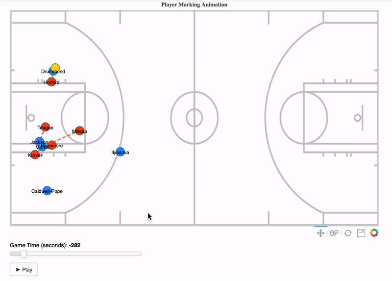
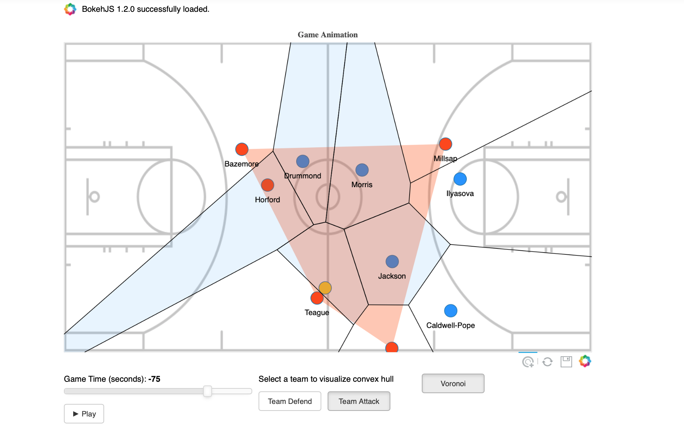
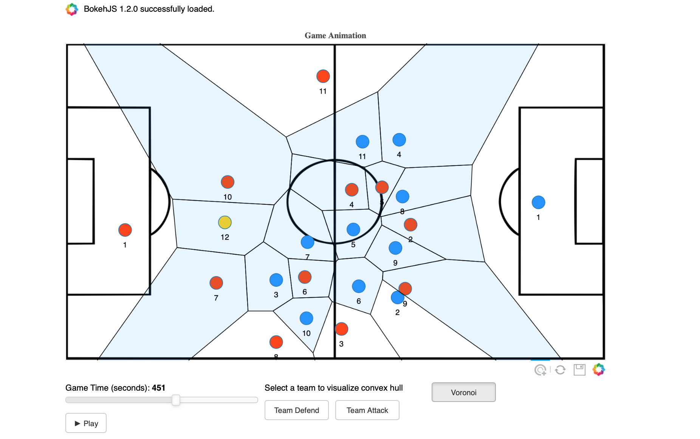
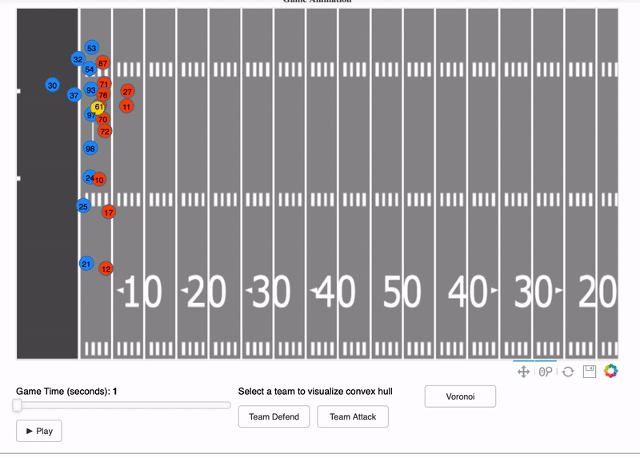
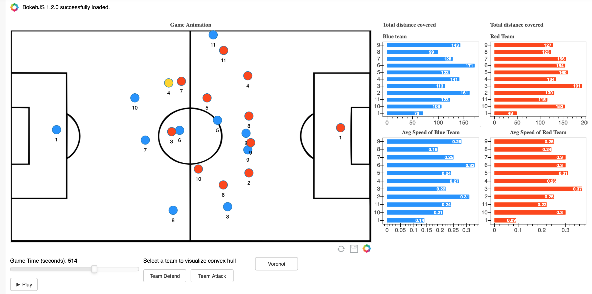
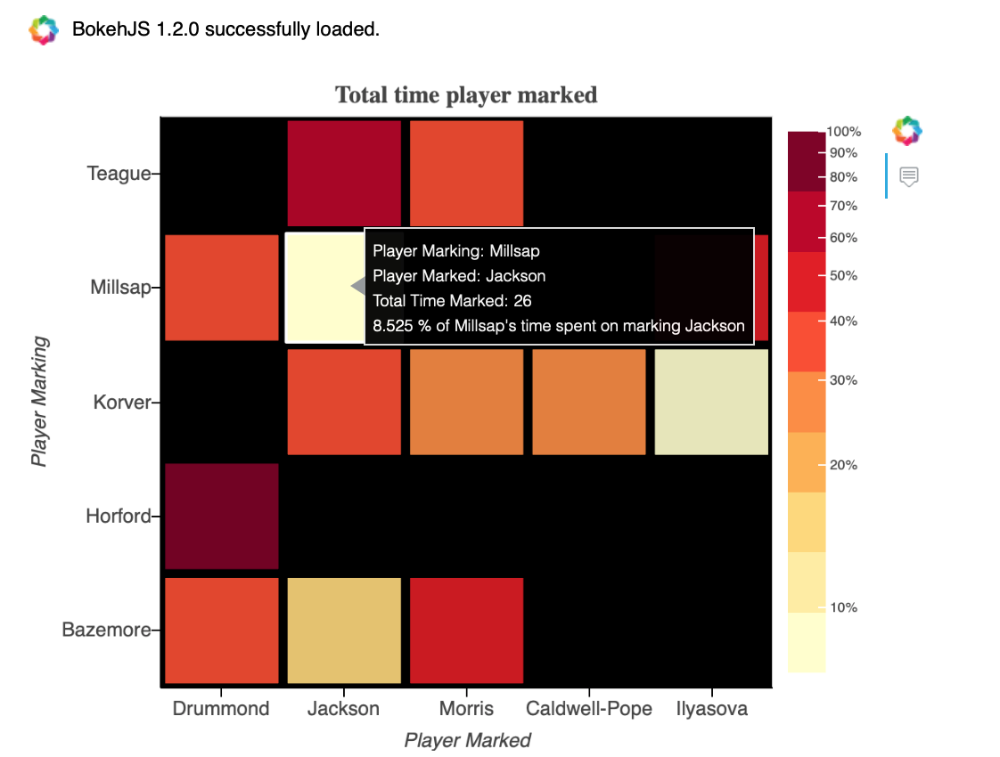
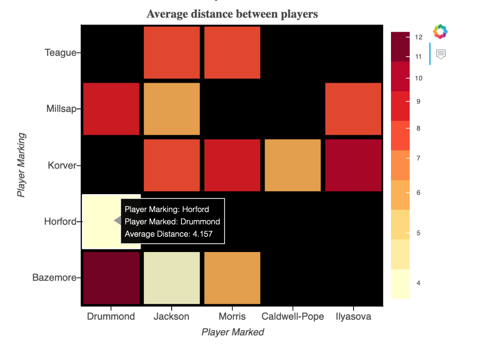

Game Animation
====
An easy way to visualize player tracking data with animation. Built using [Bokeh Plots](https://github.com/bokeh/bokeh), this tool can be used to visualise player movements for all sport. It also includes visualising voronoi and convex hulls, player speed and total distance covered by each player, interactively.

## New Features: 

Visualize players being marked by opposition players and find the distance between them. Statistics such as `total time player was marked`, `average distance between the players` can also be calculated and visualised. 


---
#### Player Marking



---

The code was tested on **`Python 3.7.1`**, but should work for other versions as well. 

The following packages are needed in order to run the code (*Bokeh plot version has to be 1.2.0 but for other packages with older versions, the tool should work*) :

| Package |Version|
|--|--|
| Numpy |1.16.4|
|Pandas|0.24.2|
| Bokeh|1.2.0|
| Scipy|1.3.0|
| Notebook|5.7.8|


The animation plot can be viewed directly on a `Jupyter Notebook`. 

### Usage
--- 
- 3 sample notebook examples ([Soccer_example.ipynb](Soccer_example.ipynb), [Basketball_example.ipynb](Basketball_example.ipynb) and [NFL_example.ipynb](NFL_example.ipynb)) are placed in the folder. 

- The background pitch images are placed in `/static/images/` folder.  


***Please see [Functions Helper](Functions_helper.md) for additional information regarding usage of different functions.***

***Please see [Notes](NOTES.md) for additional information regarding potential errors and usability of the tool.***
 
<br>

### Sample basketball animation
---

```
#import make_plot from game_animation

from Animation.game_animation import make_plot
from bokeh.io import show, output_notebook
import pandas as pd
from functools import partial

#output_notebook shows the graph within the notebook
output_notebook()

df = pd.read_csv("sample_data/sample_basketball.csv")
image_url=["static/images/basketball.png"]

id_def=65
id_att=37
x_range=(0,94)
y_range=(0,50)

make_anim_plot = partial(make_plot, df=df, id_def = id_def, id_att = id_att,
                           headers = ["x", "y", "team_id", "player_id","time"], 
                           image_url=image_url, slider_steps=1,sport='basketball', 
                           x_range=x_range,y_range=y_range, anim_speed=50)

show(make_anim_plot)
```

### Sample soccer animation:
---
```
from Animation.game_animation import make_plot
from bokeh.io import show, output_notebook
import pandas as pd
from functools import partial

output_notebook()

df = pd.read_csv('sample_data/soccer_sample.csv')
image_url = 'static/images/soccer.png'

x_range=(-52.5,52.5)
y_range=(-34, 34)

id_def = 2
id_att = 1

make_anim_plot = partial(make_plot, df=df,image_url=image_url, id_def=id_def, id_att = id_att,
                           x_range=x_range, y_range=y_range, slider_steps=1,
                           headers = ["x", "y", "team_id", "player_id","time"], 
                           anim_speed=60)

show(make_anim_plot)
```

### Sample player marking animation:
---
```
from Animation.player_marking import player_marking
from bokeh.io import show, output_notebook
import pandas as pd
from functools import partial

output_notebook()

df = pd.read_csv('sample_data/soccer_sample.csv')
image_url = 'static/images/soccer.png'

x_range=(-52.5,52.5)
y_range=(-34, 34)

id_def = 2
id_att = 1

make_anim_plot = partial(player_marking, df=df,image_url=image_url, id_def=id_def, id_att = id_att,
                           x_range=x_range, y_range=y_range, slider_steps=1,
                           headers = ["x", "y", "team_id", "player_id","time"], 
                           anim_speed=60, attack=True,sport='football')

show(make_anim_plot)
```

### Sample player marking stats:
---
```
from Animation.marking_details import marking_stats
import pandas as pd

df = pd.read_csv('sample_data/soccer_sample.csv')

id_def = 2
id_att = 1

marking = marking_stats(df=df, id_def=id_def, id_att = id_att,
                           time_steps=1,
                           headers = ["x", "y", "team_id", "player_id","time"], 
                           attack=True,threshold = 10)
```

### Sample Outputs:
---

### Game Animation
---








### Player Marking Animation
---


### Player Marking Stats
---



---

All feedbacks are appreciated.

Reach out to me on [Twitter](https://twitter.com/Samirak93) and you can also find my LinkedIn page [here](http://linkedin.com/in/samirakumar/)
